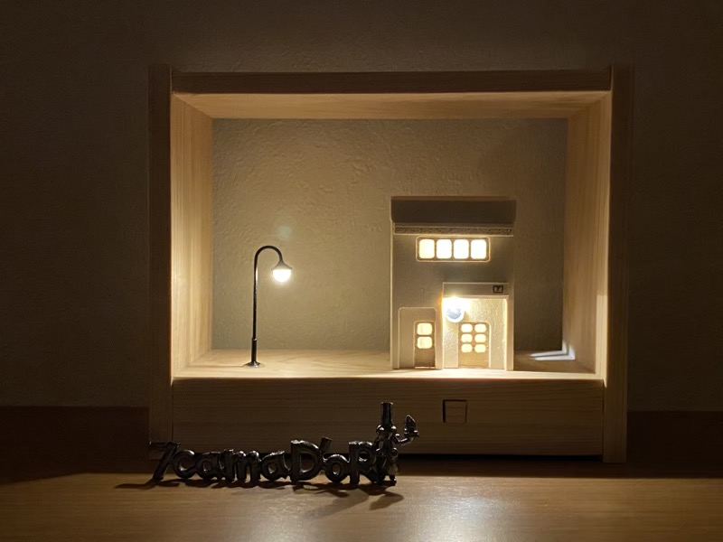
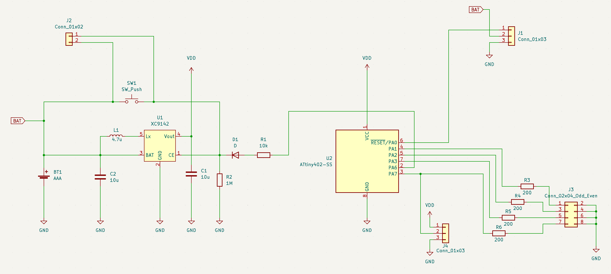

# arduino-attiny402-tiny-house

"小さなお家" の各LEDをランダムに順次点灯し，一定時間後に順次消灯する，LED制御ソフトウェア．

## Hardware

### Features

- Microchip ATtiny402
- Maximum four LEDs
- DC/DC enable control

### Pin Assignment

| GPIO | Arduino | Description |
|--- | --- | --- |
| PA0 | D5 | Reset/UPDI |
| PA1 | D2 | PWM, LED Control |
| PA2 | D3 | PWM, LED Control |
| PA3 | D4 | PWM, LED Control |
| PA6 | D0 | GPIO, DC/DC Control |
| PA7 | D1 | PWM, LED Control |

### Schematics

## Software

### Development Environment

- Arduino IDE Version 2.3.2

### Boards Manager

 - megaTinyCore 2.6.10, ATtiny412/402/212/202
